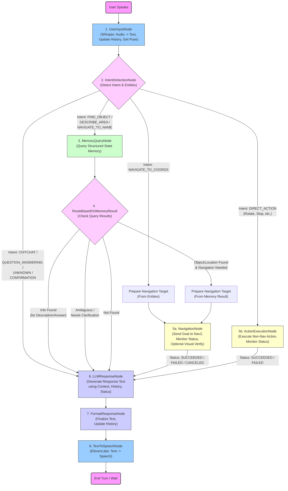

**Prompt for Copilot: Implement Assistance Mode LangGraph Flow for Autonomous Mobile Robot**

**Objective:** Implement the core Python logic for the "Assistance Mode" of a modular, autonomous mobile robot system using the LangGraph framework. This mode focuses on user interaction (voice), context-aware task handling, and robot action orchestration based on previously gathered environmental knowledge.

**System Context:**

*   The robot operates in two modes: Exploration (already handled, provides input) and Assistance (to be implemented).
*   **Exploration Mode Output:** This mode generates a map (via ROS 2 Nav2) and a structured state memory representing the environment. The **critical output** for Assistance Mode is this structured memory, defined by the following JSON schema:

    ```json
    {
      "schema_version": "1.1",
      "memory_creation_time": "YYYY-MM-DDTHH:mm:ssZ",
      "viewpoints": {
        "vp_XXX": {
          "entry_id": "vp_XXX",
          "entry_type": "viewpoint_context",
          "map_coordinates": {"x": float, "y": float, "theta": float},
          "timestamp": "YYYY-MM-DDTHH:mm:ssZ",
          "semantic_summary": "VLM generated text summary of the scene from this viewpoint.",
          "image_captures": [
            {
              "image_id": "img_vpXXX_aYYY",
              "relative_angle_deg": float,
              "timestamp": "YYYY-MM-DDTHH:mm:ssZ",
              "image_path": "path/to/image.jpg",
              "depth_map_path": "path/to/depth.png", // Optional
              "detected_object_instance_ids": ["obj_instance_id_1", "..."]
            }
            // ... more image captures
          ]
        }
        // ... more viewpoints
      },
      "object_instances": {
        "obj_instance_id_1": {
          "entry_id": "obj_instance_id_1",
          "entry_type": "object",
          "label": "object_label", // e.g., "mug"
          "confidence": float,
          "map_coordinates": {"x": float, "y": float, "theta": float /* Optional */ /*, "z": float Optional */},
          "timestamp": "YYYY-MM-DDTHH:mm:ssZ",
          "detected_in_images": [
            {
              "image_id": "img_vpXXX_aYYY",
              "viewpoint_id": "vp_XXX",
              "bounding_box_pixels": [xmin, ymin, xmax, ymax]
            }
            // ... more detections
          ],
          "best_view_image_id": "img_vpZZZ_aWWW", // Optional
          "image_snippet_path": "path/to/snippet.jpg", // Optional
          "relative_position_description": "Optional text description" // Optional
        }
        // ... more object instances
      }
    }
    ```
    *   Assume this JSON data is accessible, potentially loaded into memory or queryable via a helper function/class (`query_memory(entity_type, criteria)`).

*   **Assistance Mode Goal:** Process user voice commands via an event-driven LangGraph flow to perform tasks like object finding, navigation, answering questions about the environment, and general conversation. Minimize direct LLM calls for simple tasks.

**Core Implementation Task: LangGraph Flow**

Implement the LangGraph flow as defined by the following flowchart (Mermaid syntax):



**Detailed Implementation Requirements:**

1.  **LangGraph State:** Define a Python class or TypedDict representing the graph's state. It should include fields like: `user_input_text`, `dialogue_history` (list of tuples), `current_intent`, `extracted_entities` (dict), `memory_query_results` (list of dicts matching schema), `navigation_target` (tuple or None), `navigation_status`, `action_status`, `llm_response_text`, `final_response_text`, `requires_clarification` (bool), `error_message`, `current_robot_pose` (tuple). Ensure type hints are used.

2.  **LangGraph Nodes:** Implement Python functions or methods for each node in the flowchart.
    *   **`UserInputNode`:** Interface with Whisper (assume function `transcribe_audio()` exists). Get robot pose (assume function `get_current_pose()` returns `(x, y, theta)`). Update state.
    *   **`IntentDetectionNode`:** Implement logic (can start simple, e.g., keyword/regex, or suggest placeholder for more complex NLU/LLM call) to populate `current_intent` and `extracted_entities`. Use `dialogue_history` for context if possible. Define expected intents (e.g., `FIND_OBJECT`, `NAVIGATE_TO_NAME`, `NAVIGATE_TO_COORDS`, `DESCRIBE_AREA`, `DIRECT_ACTION`, `CHITCHAT`, `QUESTION_ANSWERING`, `CONFIRMATION`, `UNKNOWN`).
    *   **`MemoryQueryNode`:** Implement logic to query the structured memory (using the assumed `query_memory()` function) based on `current_intent` and `extracted_entities`. Populate `memory_query_results`. Handle ambiguity/not found cases by setting `requires_clarification` or relevant flags. Extract `map_coordinates` into `navigation_target` if applicable.
    *   **`PrepNavTargetCoords` / `PrepNavTargetMemory`:** Simple nodes to extract/format the navigation goal coordinates into `state["navigation_target"]`.
    *   **`NavigationNode`:** *Crucial Integration Point.*
        *   Interface with ROS 2 Nav2 stack (assume helper functions/class exist, e.g., `send_nav_goal(x, y, theta)` and `get_nav_status()`).
        *   This node likely needs to handle **asynchronous operation**. Design it so the graph can yield or wait for navigation completion. Update `navigation_status` (e.g., `PLANNING`, `IN_PROGRESS`, `SUCCEEDED`, `FAILED`).
        *   Include placeholder logic for optional visual verification upon arrival (e.g., call `verify_object_at_location()`).
    *   **`ActionExecutionNode`:** Interface with robot hardware controllers (assume functions like `execute_robot_action(action_type, params)` exist). Handle status updates similarly to `NavigationNode`.
    *   **`LLMResponseNode`:** Construct prompt based on current state (intent, history, memory results, action status, clarification needs, errors). Call the main LLM (assume function `call_main_llm(prompt)` exists). Update `llm_response_text`.
    *   **`FormatResponseNode`:** Process `llm_response_text` or use predefined strings for simple confirmations/errors. Populate `final_response_text`. Add robot response to `dialogue_history`.
    *   **`TextToSpeechNode`:** Interface with ElevenLabs API (assume function `synthesize_speech(text)` exists and plays audio).

3.  **Graph Construction:** Use LangGraph library (`StatefulGraph` or similar) to define the state and connect the nodes according to the flowchart logic. Implement the conditional edges based on `state["current_intent"]` (after `IntentDetectionNode`) and `state["memory_query_results"]`/`state["requires_clarification"]` (after `MemoryQueryNode`).

4.  **External Interfaces:** Clearly mark where external calls happen (Whisper, ElevenLabs, Main LLM, ROS 2 Nav2, Robot Actions, Memory Query). Use placeholder functions/classes for these interactions initially.

5.  **Error Handling:** Implement basic error handling within nodes (e.g., API call failures, navigation failures) and update `state["error_message"]`. Ensure error states can route correctly (usually to `LLMResponseNode` to inform the user).

**Output Expectations:**

*   Provide Python code implementing the LangGraph `State`, the `Nodes` (as functions or class methods), and the `Graph` construction.
*   Use type hints extensively.
*   Include comments explaining the logic, especially at integration points and decision branches.
*   Structure the code modularly (e.g., separate file for state definition, node functions, graph construction).
*   Highlight areas requiring asynchronous handling (`NavigationNode`, potentially `ActionExecutionNode`).

**Style Guidelines:**

*   Follow PEP 8 conventions.
*   Prioritize clarity and maintainability.

Feel free to ask clarifying questions about any part of the architecture or requirements. Your task is to translate this design into functional Python code using LangGraph.
