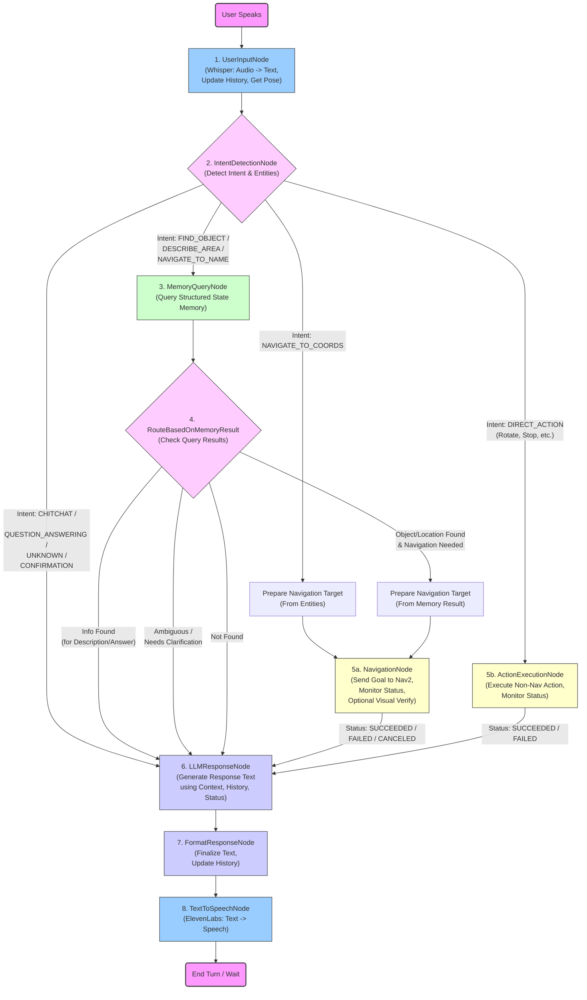

# Autonomous Mobile Robot - Assistance Mode

This project implements the "Assistance Mode" for a modular autonomous mobile robot using the LangGraph framework. This mode enables user interaction (voice), context-aware task handling, and robot action orchestration based on previously gathered environmental knowledge.

## Overview

The robot operates in two modes:

*   **Exploration Mode:** Generates a map and structured state memory of the environment.
*   **Assistance Mode:** (This project) Processes user voice commands to perform tasks like object finding, navigation, and answering questions.

## Core Components

*   **LangGraph Flow:** Defines the state and transitions for processing user commands.
*   **Nodes:** Individual functions or methods that perform specific tasks within the LangGraph flow (e.g., speech-to-text, intent detection, memory query, navigation).
*   **External Interfaces:** Integrations with external services and robot hardware (e.g., Whisper, ElevenLabs, ROS 2 Nav2, robot controllers).

## LangGraph Flow Diagram

## Implementation Details

Refer to the `implementation.prompt.md` file for detailed implementation requirements, including:

*   LangGraph state definition
*   Node implementations
*   Graph construction
*   External interface specifications
*   Error handling

## Getting Started

1.  Clone the repository.
2.  Install dependencies.
3.  Configure external API keys (Whisper, ElevenLabs, LLM).
4.  Set up ROS 2 Nav2.
5.  Run the Assistance Mode LangGraph flow.

## Contributing

Contributions are welcome! Please submit pull requests with clear descriptions of the changes.